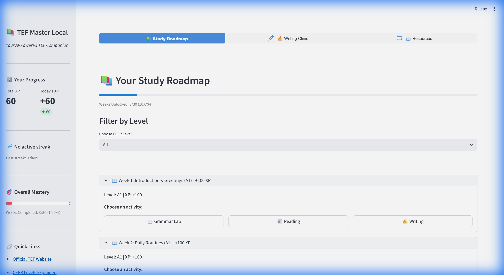

# TEF Master Local

A comprehensive, locally hosted Learning Management System (LMS) for TEF (Test d'Évaluation de Français) exam preparation.


*An overview of your progress and next steps.*

## 🚀 Features

### 📚 Dynamic Study Roadmap

*Track your progress through a 30-week curriculum from A1 to B2.*

- **Gamification**: XP points, streaks, and progressive unlocking
- **Grammar Lab**: AI-generated explanations + fill-in-the-blank exercises
- **Reading Lounge**: AI-generated articles + comprehension questions

### ✍️ TEF Writing Clinic

*Get instant, rubric-based feedback on your essays.*

- **5 TEF task types** (Fait Divers, Letters, Emails)
- **AI grading** with official TEF rubric
- **Detailed feedback** on Structure, Vocabulary, and Grammar
- **Score out of 450 points**

### 📖 Resource Library
- 35+ curated free resources
- Search and category filtering
- Favorites system
- **Easily extensible** - add your own resources!

### 🎙️ Voice Tutor (Optional)
- Speaking practice with AI questions
- Whisper STT for transcription
- gTTS for AI voice
- Pronunciation feedback

## 🖥️ Technical Stack

- **Frontend**: Streamlit with `streamlit-option-menu`
- **AI Backend**: Ollama with Gemma 3:4b
- **Database**: SQLite3 for progress tracking
- **Hardware**: Optimized for NVIDIA GPU (CUDA)

## 📦 Installation (WSL/Linux)

### Prerequisites
- Python 3.9+
- WSL2 (Ubuntu 24.04) or Linux
- [Ollama](https://ollama.ai) installed
- NVIDIA GPU with CUDA support (recommended)

### Quick Start

1. **Navigate to project directory**:
   ```bash
   cd ~/TEF
   ```

2. **Run the setup script**:
   ```bash
   chmod +x setup.sh
   ./setup.sh
   ```
   This will:
   - Create a virtual environment (optional but recommended)
   - Install PyTorch with CUDA support
   - Install all dependencies
   - Install Ollama (if not present)
   - Pull the Gemma 3:4b model from Ollama
   - Optionally install Voice Tutor dependencies

3. **Launch the application**:
   ```bash
   ./launch.sh
   ```

4. **Access the app**:
   - Desktop: http://localhost:8501
   - Mobile: http://YOUR_LOCAL_IP:8501 (IP shown in terminal)

### Alternative: Manual Installation

```bash
# Install Ollama
curl -fsSL https://ollama.com/install.sh | sh

# Create virtual environment
python3 -m venv venv
source venv/bin/activate

# Install dependencies
pip install -r requirements.txt

# Pull Gemma model
ollama serve &  # Start Ollama server
ollama pull gemma:4b

# Run the app
streamlit run app.py --server.address=0.0.0.0 --server.port=8501
```

## 📱 Mobile Access

The app is optimized for mobile devices:
1. The launch script shows your local IP automatically
2. On your mobile device, navigate to `http://YOUR_IP:8501`
3. Ensure both devices are on the same network

## 🎯 Usage Guide

### Study Roadmap
1. View your weekly curriculum organized by CEFR level
2. Complete Grammar Lab exercises to earn XP
3. Read AI-generated articles and answer questions
4. Unlock new weeks by completing previous content

### Writing Clinic
1. Select a TEF task type
2. Write your essay (60-200 words depending on task)
3. Get instant AI grading with detailed feedback
4. Review suggestions to improve

### Resource Library
1. Browse curated resources by category
2. Search for specific topics
3. Mark favorites for quick access
4. **Add your own resources** in `data/resources.py`

### Voice Tutor (Optional)
1. Enable in `config.py` by setting `ENABLE_VOICE_TUTOR = True`
2. Install dependencies: `pip install openai-whisper gtts`
3. Install ffmpeg: `sudo apt install ffmpeg`
4. Practice speaking with AI-generated questions

## 🔧 Configuration

Edit `config.py` to customize:
- XP values per activity
- Ollama model and server settings
- Feature flags (Voice Tutor on/off)
- App styling and theme

## 📚 Adding Custom Resources

To add your own resources:

1. Open `data/resources.py`
2. Add a new entry to the `RESOURCES` list:
   ```python
   {
       "id": "gram_XXX",
       "category": "Grammar",
       "title": "Your Resource Title",
       "url": "https://example.com",
       "description": "Brief description"
   }
   ```
3. Save - changes appear immediately!

See the file for detailed examples and all available categories.

## 🐛 Troubleshooting

### "Ollama connection failed"
- Ensure Ollama is running: `ollama serve`
- Verify model is downloaded: `ollama list`

### "Slow AI responses"
- First generation is always slower (model loading)
- Subsequent responses are cached
- Ensure CUDA is properly configured for your GPU

### "Mobile can't connect"
- Check firewall settings: `sudo ufw allow 8501`
- Verify both devices are on same network
- Try the actual IP address, not `localhost`

### "Module not found" errors
- Activate virtual environment: `source venv/bin/activate`
- Reinstall dependencies: `pip install -r requirements.txt`

## 🏗️ Project Structure

```
TEF/
├── app.py                  # Main application
├── config.py               # Configuration settings
├── database.py             # SQLite database handler
├── ollama_handler.py       # AI integration layer
├── components/
│   └── progress_bar.py     # UI components
├── modules/
│   ├── roadmap.py          # Study roadmap module
│   ├── writing_clinic.py   # Writing grading module
│   ├── resources.py        # Resource library module
│   └── voice_tutor.py      # Voice practice module
├── data/
│   ├── syllabus.py         # 30-week curriculum data
│   └── resources.py        # Curated resource links
├── setup.sh                # WSL/Linux installation script
├── launch.sh               # WSL/Linux launch script
└── requirements.txt        # Python dependencies
```

## 📝 Notes for WSL Users

- **Python**: WSL uses `python3` command (not `python`)
- **Virtual Environment**: Recommended to isolate dependencies
- **Ollama**: Install with `curl -fsSL https://ollama.com/install.sh | sh`
- **Firewall**: May need to allow port 8501 for mobile access
- **Model Location**: Ollama models stored in `~/.ollama/models/`

## 💡 Tips

- Use `source venv/bin/activate` before running the app
- Keep Ollama running in background with `ollama serve &`
- Check model is loaded: `ollama list`
- View logs: Check terminal output for errors

## 🤝 Contributing

Feel free to:
- Add more resources to `data/resources.py`
- Extend the syllabus in `data/syllabus.py`
- Improve AI prompts in `ollama_handler.py`
- Enhance UI components

## 🙏 Credits

Built with:
- [Streamlit](https://streamlit.io)
- [Ollama](https://ollama.ai)
- [Gemma by Google](https://ai.google.dev/gemma)
- Resources from TV5Monde, RFI Savoirs, and the French learning community

---

**Happy studying! Bonne chance with your TEF exam! 🇫🇷**
