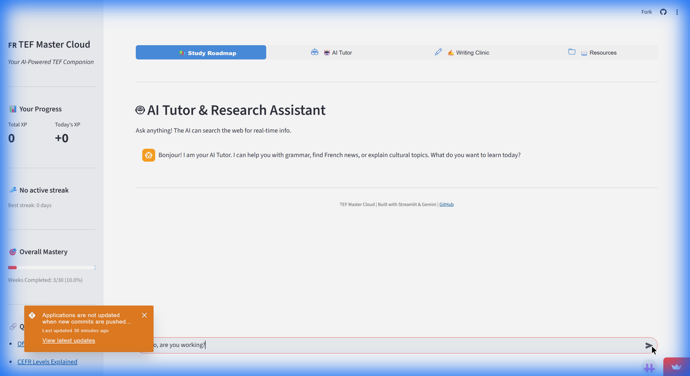

# 🇫🇷 TEF Master Cloud


[](https://tef-master.streamlit.app)


**TEF Master Cloud** is an advanced **Hybrid AI** study companion designed to help you achieve **CLB 7+** in the *Test d'Évaluation de Français* (TEF) Canada exam.

It combines the privacy and speed of **Local AI** (free on your laptop) with the accessibility of **Cloud AI** (free on your phone), giving you a personal French tutor that follows you everywhere.

---

## ✨ Key Features

### 🧠 Hybrid AI Architecture
*   **Auto-Switching Core**: Automatically detects your environment.
    *   ⚡ **Local Mode**: Uses `Gemma 3 (27b)` via Ollama on your PC for zero-latency, unlimited tutoring.
    *   ☁️ **Cloud Mode**: Switches to `Google Gemini (Flash)` on mobile/web deployment.
*   **Internet Powered**: The AI Tutor can now search the web for real-time news, cultural context, and grammar rules.

### 📚 Dynamic Study Roadmap
*   **30-Week Curriculum**: Structured path from A1 to B2 level.
*   **Grammar Lab**: AI generates infinite fill-in-the-blank practice questions tailored to the week's topic.
*   **Reading Lounge**: AI generates news articles and comprehension questions on the fly.
*   **Gamification**: Earn XP, track streaks, and unlock new levels.

### ✍️ TEF Writing Clinic
*   **Instant Feedback**: Submit essays for 5 TEF task types (Fait Divers, Formal Letters, etc.).
*   **Official Rubric Grading**: AI evaluates Structure, Vocabulary, and Grammar out of 450 points.
*   **Detailed Corrections**: Receive line-by-line improvements to sound more native.

### 🤖 AI Tutor & Research Assistant

*   **Chat Interface**: Ask anything about French grammar or culture.
*   **Web-Connected**: "Find me a recipe for Ratatouille" or "What is the latest news in France?"
*   **Voice Ready**: Optional module for speaking practice with Whisper STT and gTTS.

---

## 🚀 Getting Started

### Option 1: Cloud Access (Mobile Friendly)
Simply visit the deployed app: **[https://tef-master.streamlit.app](https://tef-master.streamlit.app)**

### Option 2: Local Installation (Developer Mode)

#### Prerequisites
*   Python 3.9+
*   [Ollama](https://ollama.com) (for Local AI)
*   Google Gemini API Key (for Cloud Fallback)

#### 1. Clone & Setup
```bash
git clone https://github.com/Pr33datorrr/TEF-Master-Local.git
cd TEF-Master-Local
pip install -r requirements.txt
```

#### 2. Configure Secrets
Create `.streamlit/secrets.toml`:
```toml
GEMINI_API_KEY = "your-google-api-key"
```

#### 3. Setup Local AI (Optional)
If you have a GPU, run Ollama locally for free AI:
```bash
ollama serve
ollama pull gemma2:27b  # or gemma2:9b for lighter PCs
```

#### 4. Launch
```bash
streamlit run app.py
```

---

## � Mobile Access Guide
**TEF Master Cloud** is responsive by design.
1.  **Deployment**: Use the Streamlit Cloud link for best experience.
2.  **Local Network**: If running locally, connect via `http://YOUR_PC_IP:8501`.
    *   *Note: Local AI (Ollama) typically runs on the host PC. When accessing via mobile on local network, the app on the PC handles the AI processing.*

---

## 🔧 Project Structure

```
TEF-Master/
├── app.py                  # Main Entry Point
├── ai_handler.py           # Hybrid AI Engine (Ollama + Gemini + Search)
├── config.py               # Global Settings & Feature Flags
├── database.py             # User Persistence (Firestore/SQLite)
├── modules/
│   ├── roadmap.py          # Grammar & Reading Labs
│   ├── writing_clinic.py   # Essay Grading Logic
│   └── ai_tutor.py         # Chat & Search Interface
├── data/
│   └── syllabus.py         # CEFR Curriculum Data
└── assets/                 # Images & UI Assets
```

## 🤝 Contributing
Contributions are welcome!
*   **Add Resources**: Edit `data/resources.py`.
*   **Improve Prompts**: Tweak `ai_handler.py`.
*   **Report Bugs**: Open an issue on GitHub.

---

*Built with ❤️, Python, and the Power of Open Weights.*
*Bonne chance pour votre examen TEF! 🇫🇷*
